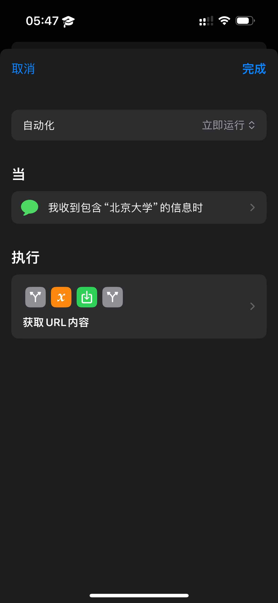
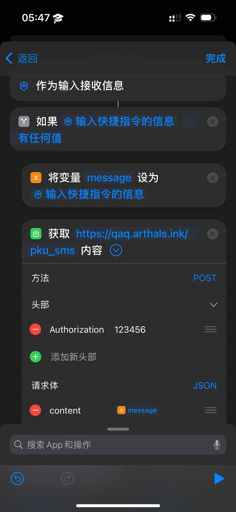
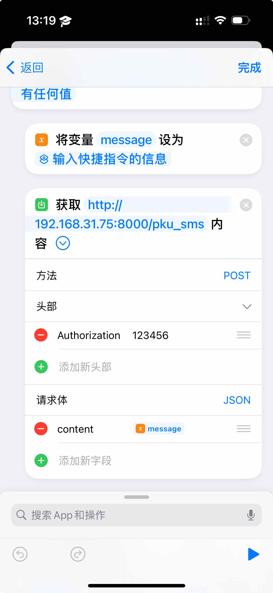
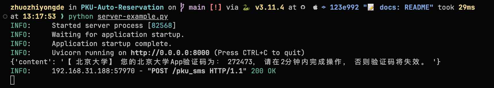

# 华清大学自动预约入校

鉴于暑假预约入校过于火爆，便有了这个小工具来提高成功率。

~~由于 2FA 的存在，这个流程无法自动化，只能半自动化完成，故你仍然需要在零点准时守在电脑前。~~

这个工具现已彻底自动化了所有网络请求，包括 2FA 验证。

## 功能

-   🚀 全自动/半自动预约入校申请
-   🤖 允许无额外服务器的情况下自动化输入验证码
-   ⏰ 零点定时提交申请，再无需上演速度与激情
-   📢 Bark 通知，包括半自动模式时提前半分钟通知准备输入、通知申请结果

## 简要上手教程

1. 复制 `config-sample.yaml` 为 `config.yaml`，并填写其中的信息
2. 安装依赖：`pip install -r requirements.txt`
3. 运行 `python main.py`

## 自动化输入验证码

> [!IMPORTANT]
> 自动化输入验证码需要设置 `config.yaml` 中的 `auto` 配置项为 `true`

由于作者设备所限，只给出 iOS 版本的方法。安卓的权限管理更为宽松，应当不难实现类似功能。

> [!NOTE]
> 注意，彻底自动化需要 iOS 17 及以上版本，因为立即执行（而无需再手动点击）是 17 出的新功能。

首先，请解绑手机北京大学 APP `我的 - 手机令牌`，因为我们无法自动化获取 TOTP 令牌来完成验证，取而代之的是使用短信验证码。

为了使得服务器获得短信验证码，我们需要使用 `快捷指令` 来将短信内容发送到服务器。

本仓库提供一个示例自动化脚本，你可以有自己的实现，但是大致思路应当相同：

1. 本仓库程序运行后，会自动请求验证码，并进行等待
2. 使用 iOS 快捷指令提供的自动化功能，当收到含有关键字 `北京大学` 的短信时，自动发送 POST 请求到你私有部署的 HTTP 服务器
3. 你的 HTTP 服务器收到请求后，通过一些手段，将内容写入本仓库根目录下的 `code.txt` 文件中
4. 本仓库程序检测到 `code.txt` 文件中有内容后，会自动使用正则表达式提取验证码，并清空 `code.txt` 文件以避免复用，然后继续运行完成 2FA 验证

### 示例自动化快捷指令

<div align="center">
    
    
    
</div>

快捷指令各步骤搜索关键字：

1. 信息
2. 新建空白自动化
3. 如果
4. 设定变量
5. 获取 URL 内容

### 示例 HTTP 服务器

参见 `server-example.py`，记得修改其中的 `code.txt` 路径与头部信息鉴权。

对于 Nginx 服务器部署、SSL 证书自签与反向代理，超出了本仓库的范围，在此不再赘述。

### 无额外服务器

如果你没有额外的服务器或者域名，那么也可以如下操作：

1. 确保零点的时候你的电脑和手机位于同一个局域网下并都保持开机
2. 修改 HTTP 服务器的侦听 Host 为 `0.0.0.0`
3. 在手机的自动化快捷指令上使用 `http://<你的电脑局域网 IP>:<端口>` 来访问电脑上的 HTTP 服务器并提交验证码

其中，mac 的局域网 IP 可以通过如下命令获取：

```bash
ifconfig | grep "inet " | grep -v 127.0.0.1 | awk '{print $2}'
```

假设获取到的电脑局域网 IP 为 `192.168.31.75`，那么示例代码如下：

`server-example.py`

```python
...
if __name__ == "__main__":
    import uvicorn

    uvicorn.run(app, host="0.0.0.0", port=8000)
```

快捷指令

<div align="center">
    
</div>

其他系统请自行搜索，Windows 或许会有额外的防火墙问题，请自行解决。

## 半自动化输入验证码

> [!IMPORTANT]
> 半自动化输入验证码需要设置 `config.yaml` 中的 `auto` 配置项为 `false`

半自动化输入验证码会在需要输入验证码时，调用 `input()` 函数来获取你手动输入的验证码。

如果你配置了 Bark，那么程序会尝试在需要输入验证码时提前半分钟通知你准备输入（不足半分钟则立即通知）。

#### 效果



## 免责说明

1. 本项目仅提供自动预约入校申请功能，节省同学时间，让广大同学拥有与黄牛的一战之力。
2. 因网络环境问题，不保证申请成功。
3. 仅供学习交流使用，**申请信息如果与事实不符可能会带来不必要的麻烦**。
4. **本仓库严禁用于任何商业用途！！！**
