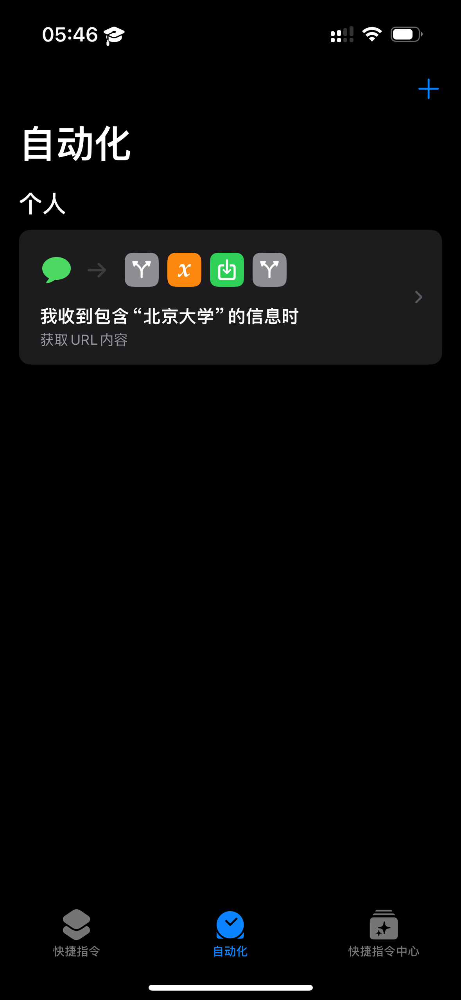
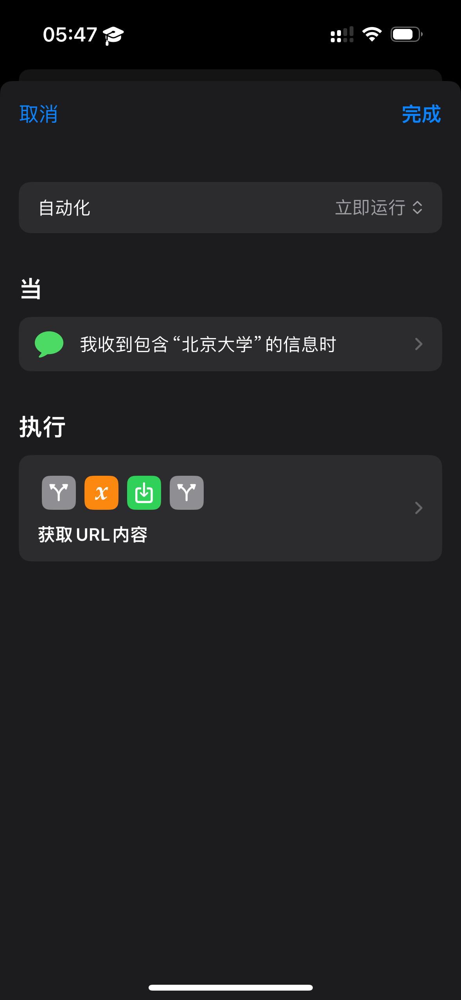
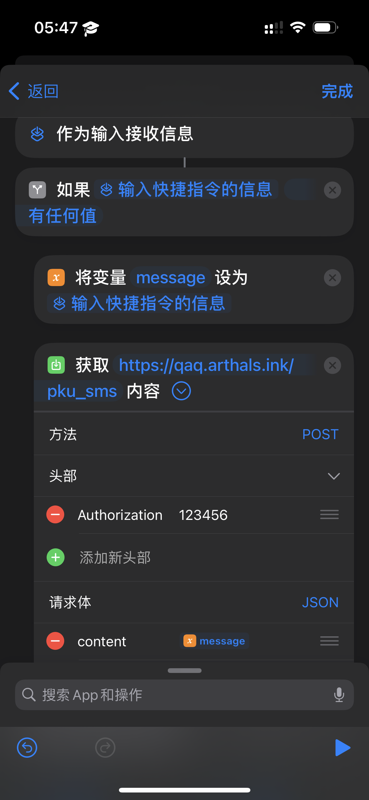

# 华清大学自动预约入校

鉴于暑假预约入校过于火爆，便有了这个小工具来提高成功率。

~~由于 2FA 的存在，这个流程无法自动化，只能半自动化完成，故你仍然需要在零点准时守在电脑前。~~

这个工具现已彻底全自动化了所有网络请求，包括 2FA 验证。

如果你不愿意/不能按照说明自动化输入验证码，想要回退到半自动化的版本，你需要参考注释，修改如下部分：

-   `session.py` 中的 `submit_request` 函数
-   `main.py` 中的 Bark 提前通知部分

## 简要上手教程

1. 复制 `config-sample.yaml` 为 `config.yaml`，并填写其中的信息。
2. 安装依赖：`pip install -r requirements.txt`。
3. 运行 `python main.py`。

## 自动化输入验证码

由于作者设备所限，只给出 iOS 版本的方法。安卓的权限管理更为宽松，应当不难实现类似功能。

首先，请解绑手机北京大学 APP `我的 - 手机令牌`，因为我们无法自动化获取 TOTP 令牌来完成验证，取而代之的是使用短信验证码。

为了使得服务器获得短信验证码，我们需要使用 `快捷指令` 来将短信内容发送到服务器。

本仓库提供一个示例自动化脚本，你可以有自己的实现，但是大致思路应当相同：

1. 本仓库程序运行后，会自动请求验证码，并进行等待
2. 使用 iOS 快捷指令提供的自动化功能，当收到含有关键字 `北京大学` 的短信时，自动发送 POST 请求到与你私有部署的 HTTP 服务器
3. 你的 HTTP 服务器收到请求后，通过一些手段，将内容写入本仓库根目录下的 `code.txt` 文件中
4. 本仓库程序检测到 `code.txt` 文件中有内容后，会自动使用正则表达式提取验证码，并清空 `code.txt` 文件以避免复用，然后继续运行完成 2FA 验证

### 示例自动化快捷指令

### 示例 HTTP 服务器

参见 `server-example.py`，记得修改其中的 `code.txt` 路径与头部信息鉴权。

对于 Nginx 服务器部署、SSL 证书自签与反向代理，超出了本仓库的范围，在此不再赘述。

## 免责说明

1. 本项目仅提供自动预约入校申请功能，节省同学时间。
2. 因网络环境问题，不保证申请成功。
3. 仅供学习交流使用，**申请信息如果与事实不符可能会带来不必要的麻烦**。
